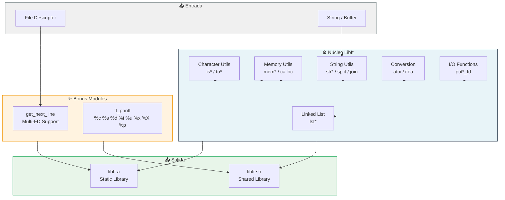

README.md creado con:

- **Título**: Libft42 + badges estéticos (C, C99, 42 School Approved, MIT, Memory Management, Algorithms, Critical Thinking)
- **Descripción**: Elevator pitch sobre la biblioteca
- **Features**: Organizadas por categorías (caracteres, memoria, strings, conversión, I/O, listas, bonus)
- **Stack**: Tabla clara de tecnologías
- **Arquitectura**: Párrafo técnico explicando decisiones (zero-dependency, gestión de memoria, flags estrictos, FOPEN_MAX para multi-FD)
- **Mermaid**: Diagrama de flujo estrecho mostrando la arquitectura modular
- **Getting Started**: Pasos secuenciales con commands bash
- **Contacto**: Links a GitHub y LinkedIn
b?style=flat-square)

Implementación desde cero de la biblioteca estándar de C, diseñada como base fundamental para proyectos complejos de programación en sistemas de bajo nivel.

---

## Descripción

**Libft42** es una biblioteca estática en C que reimplementa funciones esenciales de la libc estándar, extendiéndolas con utilidades avanzadas para manipulación de memoria, strings, listas enlazadas y E/O. Este proyecto representa el primer pilar del currículo de 42, demostrando dominio de gestión manual de memoria, punteros y estructuras de datos.

---

## Características Principales

### Funciones de Caracteres
- `ft_isalpha`, `ft_isdigit`, `ft_isalnum`, `ft_isascii`, `ft_isprint`
- `ft_toupper`, `ft_tolower`

### Funciones de Memoria
- `ft_memset`, `ft_bzero`, `ft_memcpy`, `ft_memmove`
- `ft_memchr`, `ft_memcmp`, `ft_calloc`

### Funciones de Strings
- `ft_strlen`, `ft_strlcpy`, `ft_strlcat`, `ft_strchr`, `ft_strrchr`
- `ft_strncmp`, `ft_strnstr`, `ft_strdup`, `ft_substr`
- `ft_strjoin`, `ft_strtrim`, `ft_split`, `ft_strmapi`, `ft_striteri`

### Funciones de Conversión
- `ft_atoi`, `ft_itoa`

### Funciones de Salida (File Descriptors)
- `ft_putchar_fd`, `ft_putstr_fd`, `ft_putendl_fd`, `ft_putnbr_fd`

### Listas Enlazadas
- `ft_lstnew`, `ft_lstadd_front`, `ft_lstadd_back`, `ft_lstsize`, `ft_lstlast`
- `ft_lstdelone`, `ft_lstclear`, `ft_lstiter`, `ft_lstmap`, `ft_lstremove`

### Funciones Bonus
- `get_next_line(fd)` - Lectura secuencial de líneas desde file descriptor
- `ft_printf()` - Implementación completa con especificadores: `%c`, `%s`, `%d`, `%i`, `%u`, `%x`, `%X`, `%p`
- `ft_free_2d_array`, `ft_is_integer`, `ft_charjoin`, `ft_strcmp`, `ft_strfill_fd`

---

## Stack Tecnológico

| Componente | Tecnología |
|------------|------------|
| Lenguaje | C (C99) |
| Compilador | GCC |
| Build System | Makefile |
| Salida | Biblioteca estática (`libft.a`) y dinámica (`libft.so`) |
| Dependencias | Solo headers estándar (`<stdlib.h>`, `<unistd.h>`, `<stdio.h>`) |

---

## Decisiones Técnicas

La biblioteca fue diseñada con **gestión de memoria zero-dependency**: cada función maneja su propia asignación y liberación de memoria, evitando fugas y garantizando portabilidad. El Makefile implementa compilación separada con flags estrictos (`-Wall -Wextra -Werror`) y generación automática de dependencias de headers mediante `-MMD`. Se optó por `static char* save[FOPEN_MAX]` en `get_next_line` para soportar múltiples file descriptors concurrentes, demostrando manejo avanzado de estado persistente entre llamadas.



---

## Getting Started

### Requisitos

```bash
# GCC compiler
gcc --version
```

### Compilación

```bash
# Clonar el repositorio
git clone https://github.com/samuelhm/Libft42.git
cd Libft42

# Compilar biblioteca estática (por defecto)
make

# Compilar biblioteca dinámica (.so)
make so

# Limpiar objetos
make clean

# Limpiar todo (incluye libft.a y libft.so)
make fclean

# Recompilar desde cero
make re
```

### Uso en tu proyecto

```c
#include "libft.h"

int main(void)
{
    char    *str = "   Hello, Libft42!   ";
    char    *trimmed = ft_strtrim(str, " ");
    
    ft_printf("Original: '%s'\n", str);
    ft_printf("Trimmed: '%s'\n", trimmed);
    free(trimmed);
    return (0);
}
```

```bash
# Compilar con libft
gcc -I./inc main.c -L. -lft -o program
./program
```

---

## Estructura del Proyecto

```
Libft42/
├── inc/
│   └── libft.h           # Header principal con todas las declaraciones
├── src/
│   ├── ft_*.c            # Funciones de caractéres, memoria y strings
│   ├── get_next_line.c   # Función bonus de lectura secuencial
│   ├── ft_is_integer.c   # Validación de enteros
│   ├── ft_free_2d_array.c # Liberación de arrays bidimensionales
│   └── ft_printf/        # Módulo ft_printf
│       ├── ft_printf.c
│       ├── ft_printf.h
│       ├── ft_printf_utils.c
│       └── ft_printf_utils2.c
├── obj/                  # Object files (generados)
├── libft.a               # Biblioteca estática (generada)
├── libft.so              # Biblioteca dinámica (generada con make so)
└── Makefile              # Sistema de build
```

---

## Contacto

[](https://github.com/samuelhm/)
[](https://www.linkedin.com/in/shurtado-m/)

---