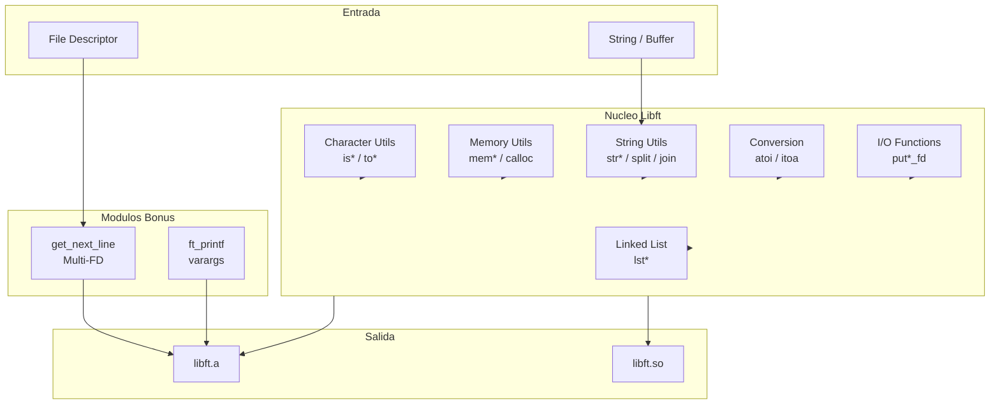

# Libft42

[](https://en.wikipedia.org/wiki/C_(programming_language))
[](https://en.wikipedia.org/wiki/C99)
[](https://42.fr/)
[](https://en.wikipedia.org/wiki/Memory_management)
[](https://en.wikipedia.org/wiki/Algorithm)
[](https://en.wikipedia.org/wiki/Critical_thinking)

Implementación desde cero de la biblioteca estándar de C, diseñada como base fundamental para proyectos de bajo nivel y sistemas embebidos. Este proyecto representa el primer pilar del currículo de 42 School, demostrando dominio de gestión manual de memoria, punteros avanzados y estructuras de datos.

---

## 📋 Características Principales

### Funciones de Caracteres
- `ft_isalpha`, `ft_isdigit`, `ft_isalnum`, `ft_isascii`, `ft_isprint`
- `ft_toupper`, `ft_tolower`

### Funciones de Memoria
- `ft_memset`, `ft_bzero`, `ft_memcpy`, `ft_memmove`
- `ft_memchr`, `ft_memcmp`, `ft_calloc`

### Funciones de Strings
- `ft_strlen`, `ft_strlcpy`, `ft_strlcat`, `ft_strchr`, `ft_strrchr`
- `ft_strncmp`, `ft_strnstr`, `ft_strdup`, `ft_substr`
- `ft_strjoin`, `ft_strtrim`, `ft_split`, `ft_strmapi`, `ft_striteri`

### Funciones de Conversión
- `ft_atoi`, `ft_itoa`

### Funciones de Salida (File Descriptors)
- `ft_putchar_fd`, `ft_putstr_fd`, `ft_putendl_fd`, `ft_putnbr_fd`

### Listas Enlazadas
- `ft_lstnew`, `ft_lstadd_front`, `ft_lstadd_back`, `ft_lstsize`, `ft_lstlast`
- `ft_lstdelone`, `ft_lstclear`, `ft_lstiter`, `ft_lstmap`, `ft_lstremove`

### Módulos Bonus
- `get_next_line(fd)` - Lectura secuencial de líneas con soporte multi-FD
- `ft_printf()` - Implementación completa con especificadores: `%c`, `%s`, `%d`, `%i`, `%u`, `%x`, `%X`, `%p`
- Utilidades adicionales: `ft_free_2d_array`, `ft_is_integer`, `ft_charjoin`, `ft_strcmp`, `ft_strfill_fd`

---

## 🛠️ Stack Tecnológico

| Componente | Tecnología |
|------------|------------|
| Lenguaje | C (C99) |
| Compilador | GCC |
| Build System | Makefile con dependencias automáticas |
| Salida | Biblioteca estática (`libft.a`) y dinámica (`libft.so`) |
| Dependencias | Solo headers estándar (`stdlib.h`, `unistd.h`, `stdio.h`) |

---

## 🏗️ Decisiones Técnicas

La biblioteca fue diseñada bajo el principio de **zero-dependency**: cada función gestiona su propia memoria sin depender de bibliotecas externas, garantizando máxima portabilidad. El Makefile implementa compilación separada con flags estrictos (`-Wall -Wextra -Werror`) y generación automática de dependencias de headers mediante `-MMD`, asegurando builds reproducibles y detección temprana de errores. Para `get_next_line`, se optó por un array estático `save[FOPEN_MAX]` que permite mantener estado persistente para múltiples file descriptors concurrentes, solucionando el reto técnico de lecturas intercaladas entre diferentes archivos sin contaminación de datos.

---

## 📊 Arquitectura



---

## 🚀 Getting Started

### Requisitos

```bash
# Verificar compilador GCC
gcc --version
```

### Compilación

```bash
# Clonar el repositorio
git clone https://github.com/samuelhm/Libft42.git
cd Libft42

# Compilar biblioteca estática
make

# Compilar biblioteca dinámica (opcional)
make so

# Limpiar objetos intermedios
make clean

# Limpiar todo (incluye libft.a y libft.so)
make fclean

# Recompilar desde cero
make re
```

### Uso en tu proyecto

```c
#include "libft.h"

int main(void)
{
    char    *str = "   Hello, Libft42!   ";
    char    *trimmed = ft_strtrim(str, " ");
    char    **split = ft_split("one,two,three", ',');

    ft_printf("Original: '%s'\n", str);
    ft_printf("Trimmed: '%s'\n", trimmed);
    ft_printf("Split[0]: '%s'\n", split[0]);

    free(trimmed);
    ft_free_2d_array((void **)split);
    return (0);
}
```

```bash
# Compilar tu proyecto con libft
gcc -I./inc main.c -L. -lft -o program
./program
```

---

## 📁 Estructura del Proyecto

```
Libft42/
├── inc/
│   └── libft.h              # Header principal
├── src/
│   ├── ft_*.c               # Funciones core
│   ├── get_next_line.c      # Lectura secuencial
│   ├── ft_is_integer.c      # Validacion de enteros
│   ├── ft_free_2d_array.c   # Liberacion de arrays
│   └── ft_printf/           # Modulo printf
│       ├── ft_printf.c
│       ├── ft_printf.h
│       ├── ft_printf_utils.c
│       └── ft_printf_utils2.c
├── obj/                     # Object files (generados)
├── libft.a                  # Biblioteca estática
├── libft.so                 # Biblioteca dinámica
└── Makefile                 # Sistema de build
```

---

## 📬 Contacto

[](https://github.com/samuelhm/)
[](https://www.linkedin.com/in/shurtado-m/)

---